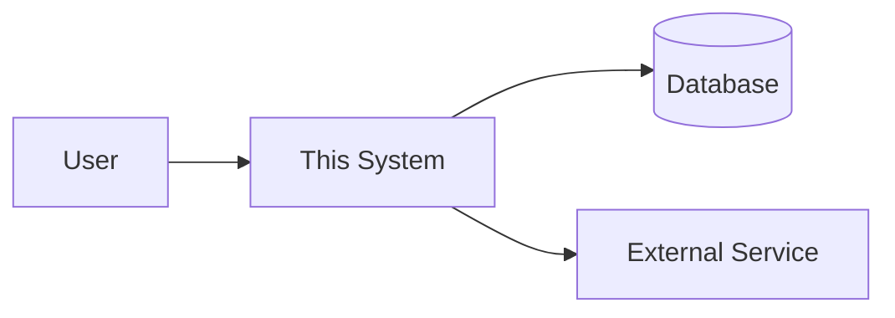

# Architecture

> The shape of the system. Claude reads this when planning anything that crosses a boundary.
>
> This file describes **structure that is already true**. Proposals live in feature plans;
> hard-to-reverse choices get an [ADR](adr/). Keep this document current — a wrong diagram is
> more expensive than no diagram.

**Last reviewed:** <!-- YYYY-MM-DD -->

---

## System Context

> What this system is, who talks to it, and what it talks to.
> A mermaid diagram is fine — Claude can read and update it. Keep it to the real boundaries.

<!-- Replace with the real context. Delete any node you don't actually have. -->

---

## Components

| Component | Responsibility | Owns | Talks to |
|---|---|---|---|
| | | | |

> "Owns" means the data or behaviour that no other component may touch directly.
> If two components both own the same thing, that is a design bug — record it and fix it.

---

## Data Model

> The nouns of the system and how they relate. Source of truth for naming.
> Link to schema/migration files rather than duplicating them here.

| Entity | Meaning | Key relationships | Defined in |
|---|---|---|---|
| | | | |

---

## Key Flows

> Walk through the two or three flows that matter most. New contributors (human or Claude)
> should be able to follow a request end to end from this section alone.

### <!-- Flow name, e.g. "User signs in" -->

1. <!-- step -->
2. <!-- step -->

---

## Boundaries and Invariants

> Things that must stay true. Claude checks plans against these.

- <!-- e.g. The web layer never touches the database directly; it goes through the service layer. -->
- <!-- e.g. Every write path is idempotent; retries are safe. -->
- <!-- e.g. Auth is enforced at the router, never in individual handlers. -->

---

## Environments

| Environment | Purpose | URL / location | Deployed from |
|---|---|---|---|
| Local | | | |
| Staging | | | |
| Production | | | |

---

## Known Debt

> Things that are wrong on purpose, with the reason and the trigger for fixing them.
> Claude will not "helpfully" fix these without asking — but it will flag when the trigger fires.

| Item | Why it's like this | When we fix it | Ref |
|---|---|---|---|
| | | | |
